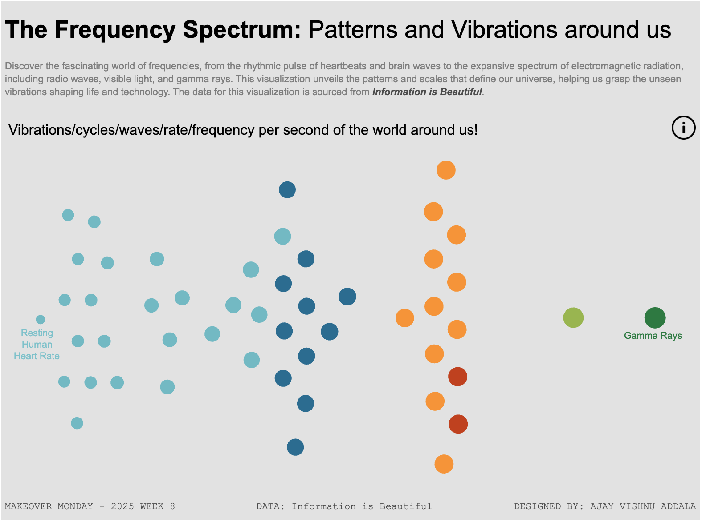

# The Frequency Spectrum: Patterns and Vibrations Around Us  

Discover the fascinating world of frequencies, from the rhythmic pulse of heartbeats and brain waves to the expansive spectrum of electromagnetic radiation, including radio waves, visible light, and gamma rays. This project uses a **Beeswarm Chart** to visualize the frequencies, cycles, and vibrations per second of various phenomena, providing insights into the patterns shaping our universe.  

## Features  
- **Beeswarm Chart**: A visually engaging representation of frequencies.  
- **Color-Coded Categories**: Units of measurement are distinguished with unique colors for easy interpretation.  
- **Interactivity**:  
  - **Hover** to reveal additional details about each data point.  
  - **Click** to open the source URL for more information.  

## Snapshot  
  
> *A glimpse of the beeswarm chart showcasing vibrations, cycles, and frequencies around us.*  

## Tableau Dashboard  
Explore the full interactive dashboard on Tableau Public:  
[View Dashboard](https://public.tableau.com/shared/XM4DDDHP4?:display_count=n&:origin=viz_share_link)  

## Data Source  
The data for this visualization is sourced from [Information is Beautiful](https://www.informationisbeautiful.net/).  
